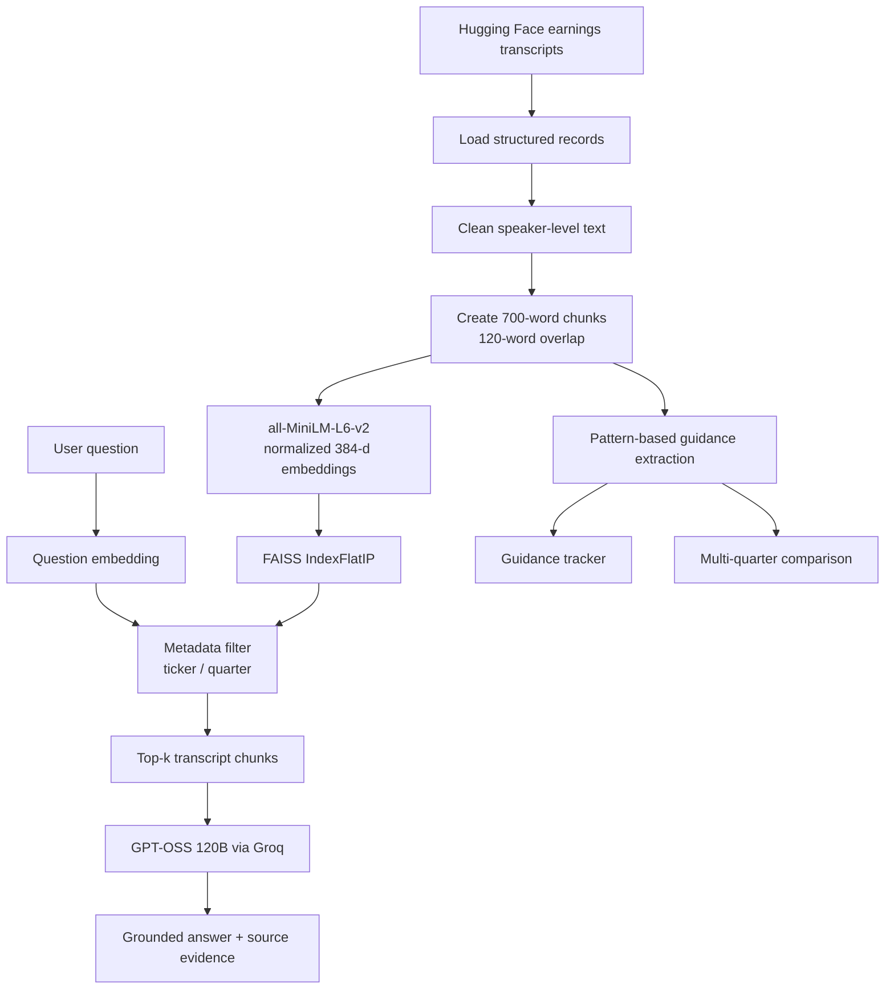

# FinSight

**Temporal Earnings Call Intelligence & RAG**

_Evidence-grounded intelligence from earnings calls._

FinSight is a prototype financial research assistant for exploring quarterly earnings-call transcripts. It combines metadata-aware semantic retrieval with grounded generation so users can ask questions about a company and quarter, inspect the transcript evidence, track likely management guidance, and compare statements across quarters.

The project is designed to demonstrate evidence-grounded, temporal RAG over financial documents. It is not a trading system, investment adviser, or production financial research platform.

## Features

- Ask questions about earnings-call transcripts through a Streamlit UI.
- Filter retrieval by ticker and quarter, or search all available quarters for a company.
- Retrieve transcript chunks with similarity scores and source metadata.
- Generate answers with `openai/gpt-oss-120b` through Groq using a restrictive grounding prompt.
- Inspect the retrieved transcript text behind each answer.
- Extract likely management guidance with a lightweight rule-based extractor.
- View a management guidance tracker by company and quarter.
- Compare extracted management statements across selected quarters for one company.
- Evaluate retrieval with Recall@K and MRR on a small manually labeled dataset.

## Architecture



The runtime application loads the prepared artifacts in `vectorstore/`, filters candidate chunks by metadata, computes similarity against the filtered embeddings, and sends the top results to the language model as context. Guidance extraction and multi-quarter comparison operate directly over the prepared chunks.

## Technology Stack

| Area                      | Technology                                            |
| ------------------------- | ----------------------------------------------------- |
| Language                  | Python 3.13 (`requires-python >=3.13`)                |
| Environment and packaging | uv                                                    |
| Frontend                  | Streamlit 1.64.0                                      |
| Data processing           | pandas 3.0.6, NumPy 2.5.3                             |
| Embeddings                | Sentence Transformers 6.1.0, `all-MiniLM-L6-v2`       |
| Vector search             | FAISS CPU 1.15.1                                      |
| Generation                | Groq API, `openai/gpt-oss-120b`                       |
| Dataset access            | Hugging Face Datasets 5.0.1                           |
| Configuration             | python-dotenv 1.2.3                                   |
| Runtime ML dependency     | torchvision 0.29.0; PyTorch is installed transitively |

## Dataset and Prepared Artifacts

The download script targets the Hugging Face dataset [`kurry/sp500_earnings_transcripts`](https://huggingface.co/datasets/kurry/sp500_earnings_transcripts). It streams records and selects the first five symbols encountered, taking up to four quarters per symbol. The current local snapshot contains:

- 5 companies: Agilent Technologies (`A`), Apple (`AAPL`), AbbVie (`ABBV`), Airbnb (`ABNB`), and Abbott Laboratories (`ABT`)
- 20 transcript records
- 1,481 speaker-level transcript rows
- 1,544 transcript chunks
- 1,544 unique chunk IDs, numbered from 0 through 1,543
- 1,544 normalized `float32` embeddings with dimension 384
- 1,544 vectors in a FAISS `IndexFlatIP` index

The four selected transcripts are not necessarily four quarters from the same calendar year for every company. For example, the local Airbnb records span 2020 and 2021.

The local `vectorstore/` artifacts are required by the Streamlit application:

```text
 vectorstore/
 |-- chunks.pkl
 |-- embeddings.npy
 `-- index.faiss
```

These artifacts, along with raw, processed, and evaluation data, are ignored by the repository's `.gitignore`. The repository includes the downloader and processing modules, but it does not currently include a single end-to-end build script that recreates `chunks.pkl`, `embeddings.npy`, and `index.faiss` from raw data.

## How It Works

### Transcript processing

`data_loader.py` converts each structured transcript into speaker-level rows while preserving:

- company and ticker
- quarter and year
- transcript date
- speaker
- text

`preprocessing.py` normalizes whitespace and removes empty text. `chunking.py` then creates overlapping word-based chunks using a default size of 700 words and an overlap of 120 words. Chunk IDs are globally unique so each row can be aligned with its embedding and FAISS position.

### Local embeddings

`embeddings.py` uses `all-MiniLM-L6-v2` locally through Sentence Transformers. Embeddings are normalized, converted to NumPy arrays, and stored as `float32`. Local embeddings avoid a separate embedding API, reduce recurring cost, keep retrieval local, and make repeated experiments easier.

### Metadata-aware FAISS retrieval

`retriever.py` uses FAISS `IndexFlatIP` for inner-product search. Since the stored embeddings are normalized, inner product serves as cosine-style similarity. Before ranking, the retriever can restrict candidates by:

- ticker
- quarter

The UI exposes a top-k slider from 3 to 10, with a default of 5. Each result is a transcript chunk rather than a complete transcript.

### Grounded generation

`rag.py` embeds the question, retrieves filtered evidence, and passes that evidence to `openai/gpt-oss-120b` through Groq. The system prompt instructs the model to:

- answer only from the supplied transcript context
- avoid outside knowledge and invented numbers or citations
- preserve quarter and year labels
- avoid substituting annual or different-quarter figures
- distinguish reported figures from calculations
- explicitly state when the context is insufficient

These constraints are intended to improve traceability and reduce unsupported claims; they do not eliminate hallucinations.

Returned sources include the ticker, company, quarter, year, speaker, chunk ID, similarity score, and transcript text. The application shows a compact source list and an expandable view of the retrieved evidence.

## Streamlit Application

Run the application to access:

- **Transcript selection:** choose a company and a quarter, including `All`.
- **Question answering:** ask a question and receive a generated answer.
- **Sources:** inspect source metadata and similarity scores.
- **Retrieved transcript evidence:** read the exact chunks supplied to the model.
- **Management Guidance Tracker:** view extracted statements by quarter and speaker.
- **Multi-Quarter Comparison:** select several quarters for the current company and compare extracted management statements.

The comparison view presents evidence from multiple quarters. It does not automatically rank companies, declare a winner, or make unsupported conclusions.

## Management Guidance Extraction

`extraction.py` uses regular-expression patterns to find guidance-like sentences containing phrases such as `we expect`, `we anticipate`, `our outlook`, `our guidance`, `we forecast`, `we target`, `we plan to`, and `expected to`. It also excludes several obvious Q&A and event-scheduling phrases.

This is deliberately a lightweight, rule-based prototype approach rather than an LLM extraction pipeline. It can produce false positives, miss guidance statements, or capture language that sounds like guidance without being formal guidance.

## Evaluation

The manually labeled evaluation set in `data/evaluation/queries.json` contains five Apple questions and relevant chunk IDs. The stored results in `data/evaluation/metrics.json` are:

| Metric    | Score |
| --------- | ----: |
| Recall@1  |  0.60 |
| Recall@3  |  1.00 |
| Recall@5  |  1.00 |
| Recall@10 |  1.00 |
| MRR       |  0.90 |

**Recall@K** measures whether relevant evidence appears in the top K retrieved results. **Mean Reciprocal Rank (MRR)** measures how highly the first relevant result appears on average.

These metrics measure retrieval quality only. They do not evaluate the factual correctness of the final generated answer. Because the evaluation set contains only five questions, it should not be treated as a statistically comprehensive benchmark or evidence of production-grade retrieval quality.

## Project Structure

```text
 FinSight/
 |-- app.py
 |-- pyproject.toml
 |-- uv.lock
 |-- .python-version
 |-- .gitignore
 |-- scripts_download_dataset.py
 |-- data/
 |   |-- raw/                    # ignored local transcript snapshot
 |   |-- processed/              # ignored; currently empty in this workspace
 |   `-- evaluation/             # ignored local evaluation artifacts
 |       |-- queries.json
 |       `-- metrics.json
 |-- vectorstore/                # ignored local retrieval artifacts
 |   |-- chunks.pkl
 |   |-- embeddings.npy
 |   `-- index.faiss
 |-- src/
 |   `-- finsight/
 |       |-- __init__.py
 |       |-- data_loader.py      # structured transcript loading
 |       |-- preprocessing.py    # text cleaning
 |       |-- chunking.py         # overlapping chunk creation
 |       |-- embeddings.py       # local embedding generation
 |       |-- retriever.py        # filtered FAISS retrieval
 |       |-- rag.py               # context formatting and generation
 |       |-- extraction.py       # guidance-like statement extraction
 |       `-- evaluation.py       # Recall@K and MRR helpers
 `-- notebooks/                  # currently empty
```

## Setup

### Requirements

Install Python 3.13 or newer and [uv](https://docs.astral.sh/uv/). From the repository root:

```powershell
uv sync
```

Create a `.env` file in the repository root:

```dotenv
GROQ_API_KEY=your_groq_api_key
```

Never commit this file or expose the key. `.env` is ignored by Git, as are `.venv/`, raw and processed data, evaluation artifacts, vectorstore files, and Python cache files.

The application expects the prepared files under `vectorstore/`. In a fresh checkout, obtain or generate those local artifacts before launching the app. The repository's dataset downloader only creates `data/raw/earnings_transcripts.json`; the current repository does not provide one command for the remaining preprocessing, embedding, and indexing steps.

## Usage

With the local vectorstore artifacts and `GROQ_API_KEY` configured, start Streamlit with:

```powershell
uv run streamlit run app.py
```

Then open [http://localhost:8501](http://localhost:8501). Select a company and quarter, enter a question, and choose **Ask**. Questions should be answerable from the selected earnings-call transcripts, for example:

- `What was Apple's revenue in Q1 2020?`
- `What was Apple's guidance for the December quarter?`
- `How did management's outlook change across the selected quarters?`

To download the reduced raw dataset snapshot described by the script:

```powershell
uv run python scripts_download_dataset.py
```

This command requires network access to Hugging Face and writes `data/raw/earnings_transcripts.json`. It does not rebuild the checked-in local vectorstore artifacts.

## Design Decisions

- **Local embeddings:** avoid an external embedding service and keep retrieval inexpensive and repeatable.
- **FAISS:** provide simple, fast local vector search for a prototype-sized corpus.
- **Metadata filtering:** prevent unrelated companies or quarters from competing during retrieval.
- **Grounded generation:** constrain the answer to retrieved transcript context and make insufficient evidence explicit.
- **Source evidence:** let users inspect the passages supporting an answer.
- **Rule-based extraction:** provide a fast, transparent first version of guidance tracking.
- **Small dataset:** keep the prototype feasible for focused experimentation.

## Limitations

- The current corpus has limited company and historical-quarter coverage.
- The evaluation set contains only five questions.
- Guidance extraction is pattern-based and is not production-grade.
- Retrieval quality depends on embedding similarity and chunk boundaries.
- Generated answers depend on the quality and coverage of retrieved context.
- There is no comprehensive answer-level factuality benchmark.
- The system does not externally verify claims against SEC filings or other financial sources.
- The FAISS index is sized for a local prototype rather than production-scale storage.
- The local vectorstore is an ignored runtime artifact and is not recreated by a single repository command.
- FinSight is not financial advice.

## Future Improvements

Potential next steps include:

- Expand company and historical-quarter coverage.
- Improve chunking and add hybrid lexical plus semantic retrieval.
- Add a reranker and stronger retrieval diagnostics.
- Improve guidance extraction and add KPI or topic extraction.
- Add analyst-question analysis and more sophisticated temporal trend detection.
- Build answer-level factuality evaluation.
- Expand the evaluation set to 30-50 or more questions.
- Add richer comparison summaries, caching, and performance optimization.
- Move from a prototype FAISS index to production-scale vector storage when needed.

## License

No license file or license declaration is currently present in the repository.
